Every token counts. When you're running AI agents at scale, those tokens translate directly into dollars, latency, and user experience. JSON has been the universal language of data exchange for decades, but it wasn't built for AI conversations. It wastes tokens on brackets, quotes, and whitespace that large language models don't need. This inefficiency quietly inflates your AI costs and slows down your agents. **TOON vs JSON** isn't just a technical debate—it's a business decision that impacts your bottom line. At Aexaware Infotech, we've seen startups cut their OpenAI bills by 30% overnight simply by rethinking their data format. The shift is subtle. The impact is massive.

---

### The Hidden Cost of JSON in AI Workflows

JSON is verbose. Every key-value pair carries punctuation overhead. Those curly braces, quotation marks, and commas consume tokens without adding semantic value. When an AI agent processes thousands of API calls hourly, this overhead compounds.

Consider a typical customer support AI agent. It exchanges structured data about tickets, users, and products. A moderately complex payload in JSON might use 500 tokens. The same data in a token-efficient format could use 300. Multiply that by 10,000 daily interactions, and you're looking at 2 million saved tokens per day.

At current API rates, that translates to hundreds of dollars monthly. For enterprises running multiple AI agents across departments, the waste runs into thousands. JSON's human-readability—its original strength—becomes a liability when machines are the primary consumers. The robots don't need pretty formatting. They need efficiency.

```mermaid
graph LR
    A[10,000 Daily API Calls] --> B[JSON Format<br/>500 tokens each]
    A --> C[TOON Format<br/>300 tokens each]
    B --> D[5M tokens/day<br/>$150M monthly]
    C --> E[3M tokens/day<br/>$90M monthly]
    D --> F[💰 Annual Cost: $1,800]
    E --> G[💰 Annual Cost: $1,080]
    
    style B fill:#E07A5F,stroke:#81B29A,stroke-width:3px,color:#000
    style C fill:#81B29A,stroke:#3D5A80,stroke-width:3px,color:#000
    style F fill:#E07A5F,stroke:#000,stroke-width:2px
    style G fill:#81B29A,stroke:#000,stroke-width:2px
```

---

### What Is TOON and Why It Exists

TOON stands for Token-Oriented Object Notation. Developers created it specifically for AI-to-AI communication. It strips away JSON's ceremonial syntax while preserving structured data integrity.

Think of TOON as JSON's minimalist cousin. Instead of `{"name": "John", "age": 30}`, TOON uses `name:John,age:30`. No quotes. No braces. Just the essentials. This approach emerged from production frustrations. AI engineers noticed LLMs easily understood simplified formats, so they formalized the pattern.

The format maintains type safety through position and context rather than explicit markers. It's less human-readable but dramatically more machine-efficient. At Aexaware, we first encountered TOON while optimizing a client's classification pipeline. The token reduction was immediate and substantial. The client asked if we could apply this across their entire AI ecosystem. We did.

---

### Token Efficiency: The Numbers Behind TOON vs JSON

Let's get specific. We ran controlled tests comparing TOON vs JSON across common data structures. The results consistently favored TOON.

A product catalog entry in JSON: `{"id": "PROD-123", "title": "Wireless Headphones", "price": 79.99, "stock": 150}` consumes approximately 28 tokens. The TOON equivalent: `id:PROD-123,title:Wireless Headphones,price:79.99,stock:150` uses just 16 tokens. That's a 43% reduction.

Nested structures show even greater savings. JSON's repetitive syntax multiplies overhead. TOON's flatter representation scales linearly. In our enterprise implementations, we've measured average savings of 35-45% across diverse payloads.

For a fintech client processing 50,000 transactions daily through AI review, this translated to $1,200 monthly savings on GPT-4 tokens alone. The format change required minimal code modification. The ROI appeared within the first billing cycle. The CTO called it "the fastest optimization we've ever deployed."

---

### Beyond Token Count: Performance and Scalability

Token efficiency creates ripple effects. Fewer tokens mean faster responses. LLMs process compact formats more quickly, reducing per-request latency by 15-25% in our benchmarks.

Rate limits become less restrictive. When each request uses fewer tokens, you fit more operations into your quota. This scalability unlocks new use cases. Suddenly, real-time AI agents become viable at higher throughput.

Environmental impact matters too. Shorter prompts require less compute, reducing energy consumption. For sustainability-focused enterprises, this aligns AI strategy with ESG goals.

Aexaware recently helped a logistics startup transition their route optimization agent. Beyond the 38% token savings, they saw response times drop from 2.3 seconds to 1.7 seconds. Drivers received updates faster. Customers got better ETAs. The format change improved the entire product experience. Their engineering lead said it felt like upgrading from dial-up to broadband.

---

### Real-World Implementation: From Theory to Production

Theory is easy. Production is messy. TOON vs JSON decisions must account for existing infrastructure, team expertise, and error handling.

We guided a healthcare startup through this transition last quarter. Their patient intake AI agent processed medical history forms in JSON, burning through tokens. We implemented a hybrid approach: TOON for internal AI-to-AI communication, JSON for external API compatibility.

The migration took three weeks. We built validation layers to prevent data corruption. We trained their team on debugging techniques. We monitored token usage in real-time.

Results? 41% token reduction. $2,800 monthly savings. Zero downtime. The CTO noted: "We thought this would be a niche optimization. It became our standard architecture."

This is where Aexaware's DevOps expertise proves critical. We automate format conversion, implement monitoring, and ensure graceful fallbacks. We don't just change syntax; we engineer reliability.

---

### When to Use TOON vs When to Stick with JSON

TOON isn't universal. Human-facing APIs should remain JSON. Developer tools need JSON's readability and ecosystem support.

Use TOON when:
- AI agents communicate with other AI services
- Token costs exceed 15% of your infrastructure budget
- Latency directly impacts user experience
- You're building greenfield AI systems

Stick with JSON when:
- External developers consume your APIs
- Legacy systems can't be refactored
- Data requires frequent human inspection
- You depend on JSON Schema validation

Many architectures benefit from both. Aexaware recommends a gateway pattern: accept JSON externally, convert to TOON for internal AI processing, then serialize back to JSON for the response. This maximizes efficiency without sacrificing compatibility. We've implemented this pattern for five enterprise clients this year alone.

---

### Aexaware's Expertise in Building Token-Efficient AI Systems

Token optimization is just one piece. At Aexaware Infotech, we architect complete AI ecosystems. Our teams integrate TOON adoption into broader strategies spanning web platforms, mobile apps, and cloud infrastructure.

We start with a token audit. We map your AI workflows, identify inefficiencies, and quantify potential savings. Then we design a migration path that minimizes risk. Our web developers build the conversion layers. Our mobile engineers ensure your apps communicate optimally. Our DevOps teams implement monitoring and auto-scaling.

For a Series B SaaS company, this holistic approach delivered beyond token savings. We redesigned their entire AI pipeline, incorporating TOON, caching strategies, and model selection optimization. The result: 60% total cost reduction and 3x faster agent responses.

We don't just implement formats. We engineer performance. We don't follow trends. We validate solutions in production first.

---

### The Future of AI Communication Protocols

TOON is a stepping stone. The AI community is actively exploring even more efficient protocols. Binary formats, custom token compression, and model-specific encodings are emerging.

But TOON has momentum. It's simple to implement. It's human-debuggable in a pinch. It works today.

At Aexaware, we're contributing to TOON's ecosystem. We're building open-source validation tools. We're documenting best practices. We're running performance benchmarks across different model providers.

The future isn't about replacing JSON completely. It's about using the right tool for each layer of your stack. Intelligent format selection will separate cost-leader AI companies from the rest.

We're excited about what's next. And we're preparing our clients to adopt it seamlessly. The winners in AI won't just have better models. They'll have better pipes.

---

### Summary: Choose the Right Format, Maximize Your AI ROI

TOON vs JSON isn't a religious debate. It's a business calculation. JSON remains the universal standard for human-facing APIs. TOON offers immediate, measurable savings for AI-to-AI communication.

The most token-efficient format depends on your context. Evaluate your token spend. Measure your latency. Consider your scalability needs. Then choose deliberately.

Aexaware Infotech helps startups and enterprises navigate these decisions every day. We bring expertise in AI, web development, mobile solutions, and DevOps to implement token-efficient architectures that reduce costs and improve performance.

The question isn't whether TOON vs JSON matters. The question is: how much are you willing to overpay for punctuation?

---

**Ready to optimize your AI agent's token efficiency?** 

Aexaware Infotech's team can audit your current setup, identify savings opportunities, and implement TOON or hybrid solutions tailored to your infrastructure. Let's reduce your AI costs by 30-50% while improving performance.

[Contact us today](https://www.aexaware.com/contact) for a free token efficiency assessment. Scale smarter with Aexaware.