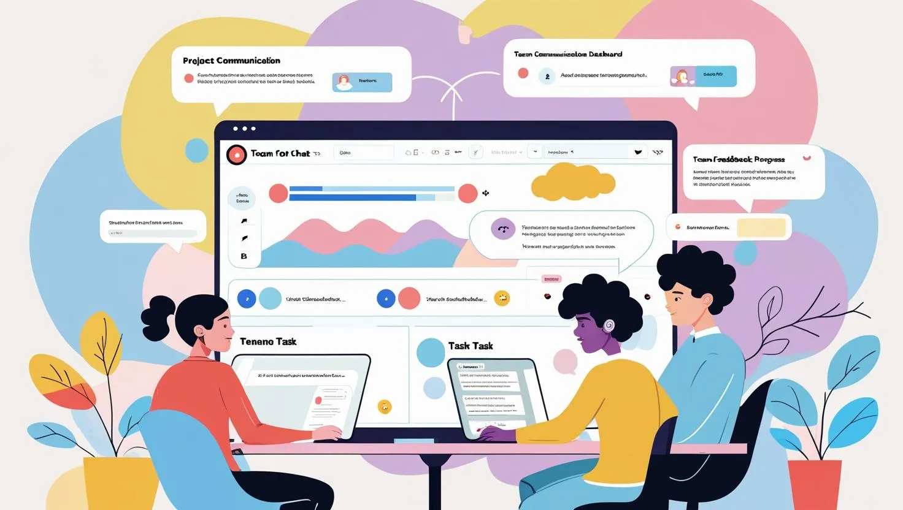

We all know that having a business website is essential, and in 2025, it's a must-have. It’s where your customers find you, trust you, buy from you, and come back for more. Whether you’re a small business or scaling a startup, your choice of web development company leads to a website that drives growth. What about customer expectations? Users won’t return to a website after a bad experience. People want fast-loading sites, smooth mobile experiences, and content that feels useful. So, make sure your site is user-friendly and reliable. Otherwise, Google will skip over it, and so will your customers. As of May 2025, [Google](https://blog.google/products/search/ai-mode-search/) officially expanded AI overviews, prioritizing sites that offer quick performance, accessible content, and AI-enhanced user journeys. That means your site is ranked not just by SEO but by its usefulness and relevance. And when it comes to building a high-performing site, experience matters. A [Clutch report](https://clutch.co/resources/small-business-growth-2025#the-top-strategic-priorities-for-smbs-in-2025) found that businesses working with expert agencies launch 45% faster and see 33% better ROI. In this guide, we’ll help you choose a trusted web development company that understands your goals and helps you build not just a website, but long-term success.

## How to Choose the Right Web Development Company For Your Business Needs?

Choosing a web development company doesn’t mean picking the first name on Google. It’s about finding an ideal team of web developers who understand your goals, fit your budget, and can meet your exact business needs. Let’s cover the aspects to consider when choosing the right [web development company](https://www.digital4design.com/web-development/) for your business requirements.

###### **1\. Start with Understanding Your Business Goals**

Ask yourself: What’s the purpose of the website? Is it for selling products, generating leads, booking services, or something else? Remember, a good web development partner will develop the solution around your goals and not only focus on how it looks.

###### **2\. Check Their Experience and Expertise**

 The next step is to look for a company with proven experience. Read their case studies, if any. Ask them if they understand the latest techniques and practices like performance optimization, mobile-first design, and AI integrations. You can also ask for samples of similar projects they’ve done to assess their work experience, skills, and expertise.

###### **3\. Look Beyond the Portfolio**

 An appealing website is not sufficient. You need a website that is quick-loading, performs well on search engines, and is conversion-oriented. See if they can handle site speed, [SEO](https://www.digital4design.com/seo/), security, and ongoing maintenance and support. In 2025, all these website aspects are non-negotiable.

###### **4\. See How They Communicate**

 Good and transparent communication is vital. See if the web development company you’re looking to hire listens to and understands your needs. They should provide clear pricing, deadlines, and deliverables. It could be a worse choice if the company fails to provide clear answers and is not transparent in terms of communication. Consider other communication aspects like:

*   Project management
*   Response time
*   Regular updates and a feedback loop

###### **5\. Read Reviews and Ask for References**

It is always better to check previous customer reviews and feedback on platforms like [Clutch](https://clutch.co/profile/digital4design), Google reviews, and Reddit. Also, see what people have to say about pricing, work quality, customer service, and expertise. It will give a brief of the company’s working standards, customer satisfaction, and how well-versed their team of developers is.

###### **6\. Understand Their Process**

A well-defined and transparent workflow is essential for a smooth web development experience. Ask the company about their process of handling the projects from the initial consultation to finish.

*   Ask what project management tools they use to ensure continuous work progress and that everyone is aligned throughout the process.
*   Find out the communication channels they use to provide work updates. Regular timelines and reports can prevent miscommunication.
*   Make sure you’ll be assigned a dedicated project manager as a point of contact to seek clarification regarding testing, upgrades, or any feedback.

Knowing the development process of the web development company you hire can help avoid surprises and keep your project on time and within budget.

###### **7\. Make Sure They’re Thinking of Long-Term Partnership**

 Every business needs to understand that its website should be developed for flexibility and scalability. Therefore, look for a web development company that helps you scale, adapt, and grow your business. Ask the company about upgrades and maintenance services, and if they want a long-term partnership or are looking for one-time projects. A reliable web development services company prioritizes long-term partnerships and will provide maintenance and support services along with implementing best **website security practices**. Thus, meeting all the development requirements.