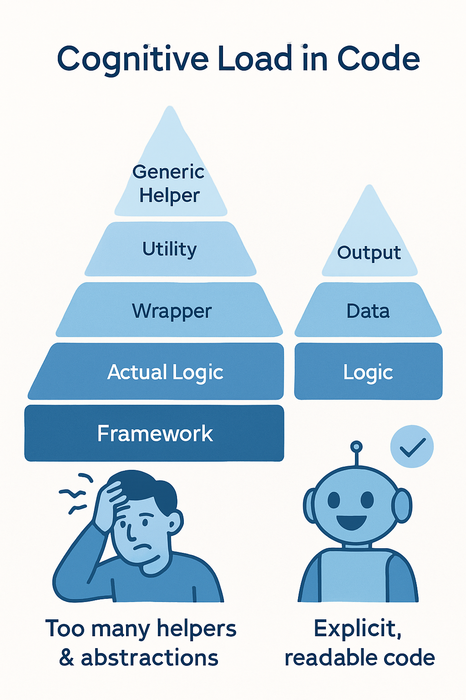

If you ship software, you’ve seen “garbage code.” Linus Torvalds recently called out an example during the Linux merge window, and the lesson is timeless: don’t add cleverness that obscures intent. Instead, reduce cognitive load, design around data, and write with taste. That’s the fastest path to **clean code** and durable systems.

## How to Not Write ‘Garbage Code’ (by Linus Torvalds): What He Meant

During an August 2025 kernel cycle, Torvalds rejected a late RISC-V pull request and labeled parts of it “garbage.” His critique centered on an unnecessary helper that hid simple bit operations, making the code harder to read and easier to misuse. In short, he prefers explicitness when semantics matter. That stance isn’t about style; it’s about reducing mistakes under pressure.

### Reduce cognitive load, not just lines of code



Modern code is read by humans and, increasingly, by AI code assistants. Every extra indirection, helper, or premature abstraction forces a micro context-switch. Consequently, readers must mentally jump to another file or function to understand what’s going on. Torvalds’ example reminds us to keep intent local, even if that means repeating a tiny operation. Engineer’s Codex frames this as optimizing for lower cognitive load, not maximal DRY.

**Action you can take:** Prefer one self-contained, obvious line over a generic helper that hides semantics.

```
// Worse: meaning is ambiguous
uint32_t x = make_u32_from_two_u16(a, b);

// Better: intent is obvious at the call site
uint32_t x = ((uint32_t)a << 16) | (uint32_t)b;
```

Therefore, developers and reviewers spend fewer brain cycles decoding the call and more on correctness.

### Prefer explicit code when semantics matter

Ambiguous helpers invite subtle bugs (e.g., word order confusion). Torvalds’ pushback was precisely about that ambiguity; he argued the explicit shift makes the “which half is high” intention unmistakable. When in doubt, write the thing you mean—near where you need it.

## Design around data structures first


Torvalds has long argued that great programmers think about data structures and their relationships more than lines of code. When you let data lead, code gets simpler because the operations become natural consequences of the model. That mindset reduces incidental complexity and slashes **technical debt**.

### “Good taste” removes special cases

In his TED talk, Torvalds illustrates “good taste” with a linked-list deletion example. The tasteful version avoids a pile of edge-case `if` statements by shaping the data and pointers so removal is uniform. Fewer branches means lower cyclomatic complexity, simpler tests, and fewer bugs. Moreover, uniformity lowers the mental tax on everyone who touches the code.

**Action you can take:** When a function explodes with corner cases, step back and revisit the data shape. Can a sentinel, a “pointer-to-pointer,” or an owning wrapper remove the special cases entirely?

## Aexaware’s 7-point checklist to avoid “garbage code”


1.  **Make intent local.** Keep meaning at the call site. Inline trivial operations; avoid generic helpers that hide semantics.
2.  **Model the data first.** Let structures drive behavior; simplify code by simplifying relationships.
3.  **Minimize context-switches.** Fewer levels of indirection → faster comprehension for humans and AI tools alike.
4.  **Delay abstractions.** Prove duplication hurts in practice before extracting helpers or frameworks.
5.  **Prefer clarity over cleverness.** Write the obvious operation explicitly when correctness or ordering matters.
6.  **Remove special cases.** Reshape data or control flow to collapse branches; aim for uniform operations.
7.  **Review for readability.** In code review, ask: “Can a new teammate explain this in one pass?” If not, simplify.

## Real-world example: from helper maze to readable service

At Aexaware, we audited a latency-sensitive fintech microservice. The code relied on a forest of “convenience” helpers for byte packing, checksum building, and retry policies. However, common call paths required hopping through 5–7 files. We inlined simple bit-twiddling and flattened tiny helpers back into the hot path. Then we re-modeled request state into a small struct, which removed two error branches.

As a result, P95 latency dropped by 18%, onboarding time for a new engineer halved, and test coverage stabilized because paths were easier to exercise. More importantly, reviewers now focus on logic, not scavenger hunts.

## Guidelines for teams using AI coding tools

AI can draft code fast, but it gladly invents thin abstractions and extra layers. Therefore, pair AI with a “cognitive load gate”:

*   Ask, “Will this abstraction force a reader to jump files?” If yes, decline it.
*   Nudge the model toward explicitness: “Write the shift/bitwise compose inline and cast carefully.”
*   Keep prompts grounded in data models first, not method counts.

## Conclusion: How to Not Write ‘Garbage Code’ (by Linus Torvalds)

Ultimately, avoiding **“garbage code”** is simple, not easy. Start with the data. Then write explicit, readable operations that minimize context-switches and remove special cases. With this discipline, your team produces software that’s easier to change, safer to ship, and kinder to reviewers—exactly what Torvalds has argued for years through examples of “good taste” and tough reviews.

* * *

## Let’s build it right — with Aexaware

Ready to turn messy code into maintainable systems? Aexaware Infotech helps startups and enterprises refactor legacy modules, reshape data models, and ship readable, performant services—without slowing your roadmap. Let’s review a critical path together and design a clean, scalable plan.

[contact-form-7 id="e81e6c8" title="Contact form 1"]