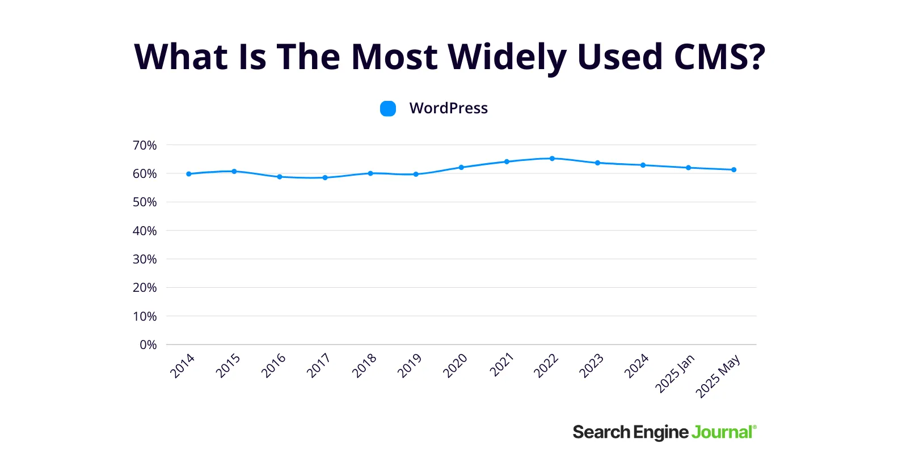
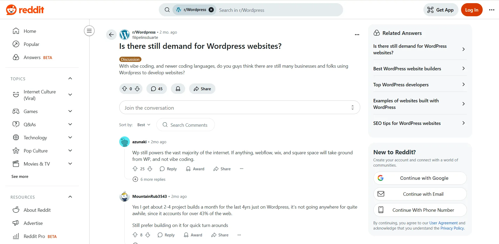
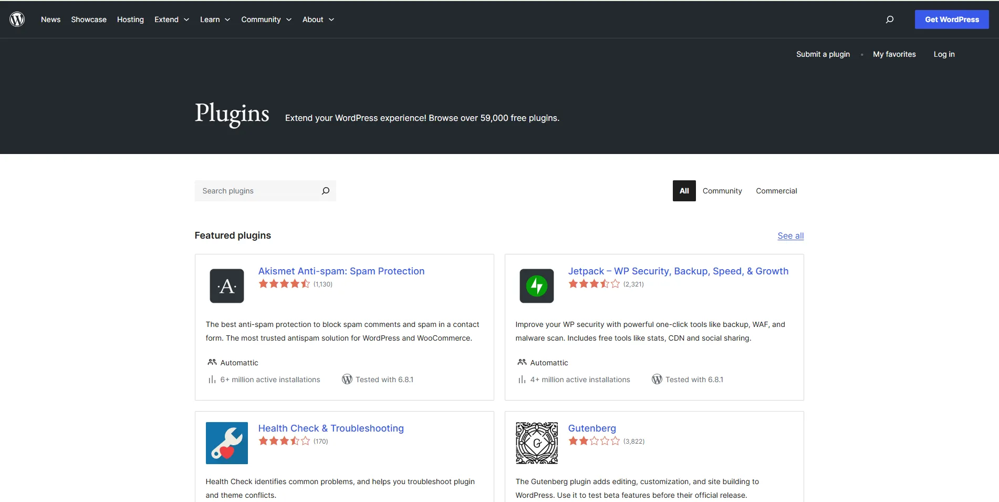

If you’re wondering whether WordPress is still the best CMS in 2025, the answer is yes. It’s still the top pick for most people, powering around [44% of all websites](https://www.searchenginejournal.com/cms-market-share/454039/) and over 60% of those using a content management system.  WordPress continues to be the best CMS choice despite the rise of no-code tools, headless platforms, and AI site builders. The reason is that it’s flexible, easy to manage, and backed by a huge community of developers, designers, and plugin development pros. Big names like [The New York Times](https://wpvip.com/case-studies/the-times-accelerate-publishing/), NASA, and [PlayStation](https://wordpress.org/showcase/playstationblog/) still use WordPress. Google’s Web Creators team recently called WordPress one of the easiest platforms to optimize for performance and Core Web Vitals. One Reddit user asked, “Is there still demand for WordPress websites?”  **Source:** [r/WordPress](https://www.reddit.com/r/Wordpress/comments/1kjj2po/is_there_still_demand_for_wordpress_websites/) Dozens of responses were in support of WordPress, stating it as a go-to platform for almost all kinds of web projects in 2025. This highlights the platform's popularity and the development freedom and control it has to offer. And WordPress isn’t just surviving, it’s improving every day. The full-site editing experience with Gutenberg blocks has gotten much better, offering users more control without requiring a developer's help for minimal modifications. So yes, WordPress is still very much relevant in 2025. In this blog, we’ll show why WordPress still leads, what makes it reliable, and how it compares to newer CMS options

## What Makes WordPress a Popular CMS Choice in 2025?

So, what exactly keeps WordPress on top after all these years? It’s not just momentum. It’s the way WordPress continues to meet the needs of users, from small business owners to large teams, while providing development flexibility. Here’s what still makes WordPress the go-to CMS in 2025: **Open-source and free-to-use** WordPress is open-source and completely free. Anyone can download it, install it, modify it, and make it their own without any additional expenses. **Huge Plugin Ecosystem** Need a contact form? SEO help? Want to build a full online store? There’s a plugin for almost everything.  **Source:** [WordPress Plugins](https://wordpress.org/plugins/) From **Elementor** for easy page building, **and Yoast SEO** for optimization, to **WooCommerce** for eCommerce, WordPress gives you tools without any need to code from scratch. **Global Developer Community** WordPress boasts a global community of developers, contributors, freelancers, and agencies. It provides access to regular updates, tons of learning resources, and answers to almost any issue you run into.

## WordPress in 2025: Strengths That Still Set It Apart

Even in 2025, WordPress is still the one most people stick with when there are tons of new website builders around, and the reasons are clear. It’s easy to use, flexible for any kind of site, and gives you control without making things complicated. Here’s what makes WordPress a solid choice today: **Great for SEO** WordPress gives you a solid SEO foundation from the start. But when you pair it with plugins like **Yoast SEO** or **Rank Math**, you get full control over titles, meta tags, sitemaps, schema markup, and more. Also, many themes are lightweight and optimized for Core Web Vitals, which makes it easier to rank. As a result, you don’t need to be an SEO expert to make your pages search-friendly. **Built for Content and Blogging** WordPress started as a blogging platform, and that strength hasn’t gone anywhere. Whether you’re publishing once a month or daily, WordPress handles content creation smoothly. The block editor makes writing and formatting easy, even for non-tech users. Ideally, WordPress is one of the easiest platforms to keep things organized and consistent if your business relies on regular content. **Works for Both Developers and Beginners** Developers love WordPress because it’s open-source and easy to extend. But it’s also great for non-coders, thanks to themes, visual editors like Elementor, and drag-and-drop plugins. Whether you’re a solo creator or part of a large team, WordPress gives you the tools that fit your skill level. **Versatile for Any Website Type** WordPress isn’t just for blogs. It’s widely used for eCommerce sites, online courses, membership platforms, and more. You can go simple or scale up without switching platforms. You won’t outgrow WordPress because it grows with you.